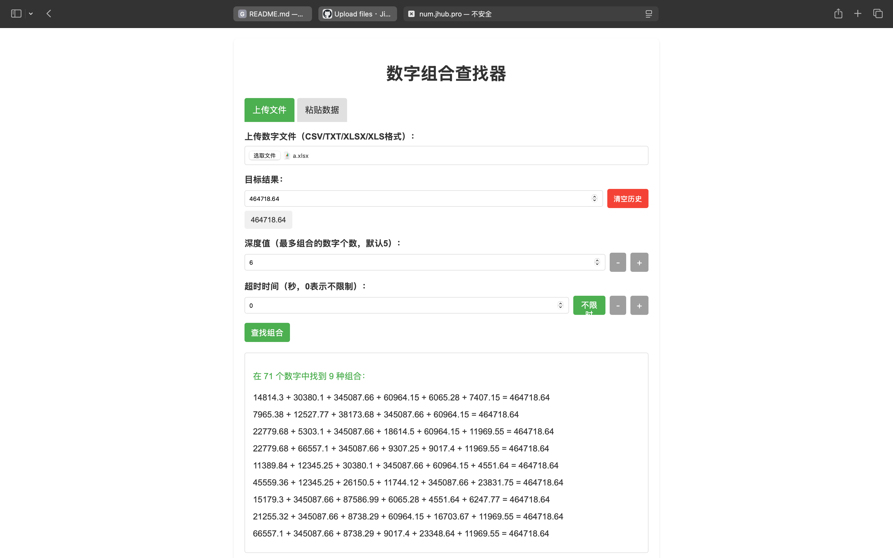
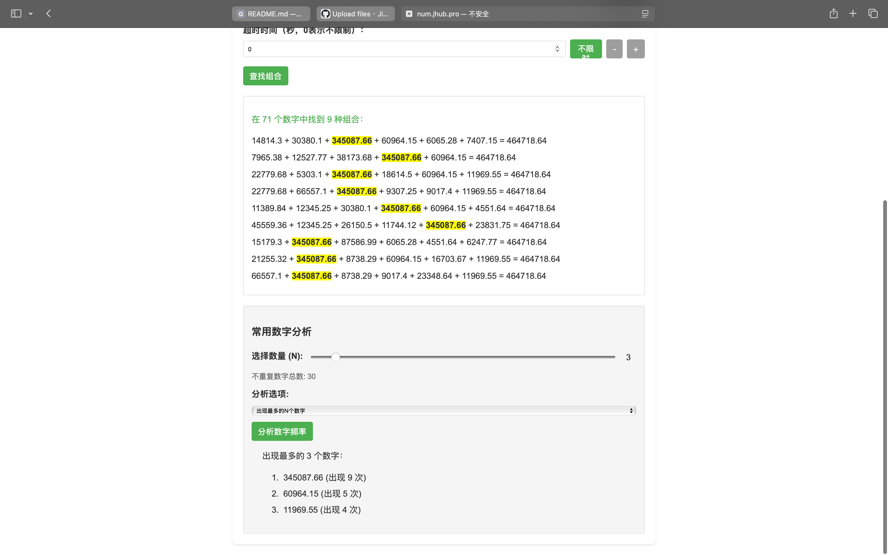

# NumScan | 数字扫描

## 项目说明

> 这是一个非常简单的金额计算网页，且内容全部由[[腾讯元宝]](https://yuanbao.tencent.com)进行开发，本人仅提供需求 → 得到结果 → 给出修改建议...如此往复以得到最终结果。

- 项目地址：http://num.jhub.pro

- 技术栈

[]()
[](https://developer.mozilla.org/en-US/docs/Web/JavaScript)
[](https://developer.mozilla.org/en-US/docs/Web/CSS)

- 截图（数据均为假数据）：

<div style="width: 100%;display: flex">



</div>

## 开发背景
由于我的**财会朋友**经常需要从一堆交易金额中寻找出相加为N的值，因此催生出了本页面，本页面前期为一个Python脚本（见`py`文件夹下的内容），仅能寻找一个结果（找到立刻Break），后面由于财会朋友找我帮忙的频率很高，因此催生出来了使用更加简单的网页版本。

## 主要功能
✅ **智能数字组合查找**  
- 支持Excel/CSV/TXT文件上传或直接粘贴数据
- 精准找出相加等于目标值的数字组合
- 支持多结果展示（自动高亮关键数字）

✅ **数字频率分析**  
- 统计每个数字出现次数
- 标记数字在组合中的位置
- 可视化高频数字排名

✅ **便捷操作**  
- 历史记录缓存功能
- 一键清空历史
- 智能参数预设

## 参数说明

| 参数 | 说明 | 注意事项 |
|------|------|----------|
| **文件/粘贴数据** | 输入数字源 | 支持多种文件格式 |
| **目标值** | 需要匹配的数值 | |
| **深度值** (默认5) | 最大组合数字个数 | 值越大耗时越长，但检索范围越大 |
| **超时时间** | 最长计算时间 | 0表示不限时 ⏱️ |

## 💡 使用技巧
1. 建议深度为5开始检索，若没有理想结果则逐渐增加深度值
2. 对高频数字(如345087.66)可重点关注
3. 使用"不限时"选项获取完整结果


## 对于Python版本的说明

> 由于网页版本是调用本地浏览器进行运算，受限于浏览器资源的限制，计算速度可能较慢，因此在这里加上Python版本的使用说明（运算会更快一点），参数及使用示例如下：

|参数|说明|备注|
|:--|:--|:--|
|第一个参数|文件名称|必须为`a.xlsx`|
|第二个参数|目标结果|一个数字（两位小数）|
|`--max_r=N`|深度值|一个数字|


示例：

```bash
# Python 脚本名称 文件名   文件名 深度为6
python3  b.py    a.xlsz 321.12 --max_r=6
```

# 部署

尽管这是一个非常简单的项目，但是你仍然可以亲自部署，在已经安装 Docker 的服务器上执行下列命令，可以快速部署：


```bash
docker run -it --name JimKKu-NumScan --restart always -p 80:80 -d jimkku/numscan
```


若是想通过 NGINX 托管，可以将 index.html 文件保存至 NGINX 托管目录即可。